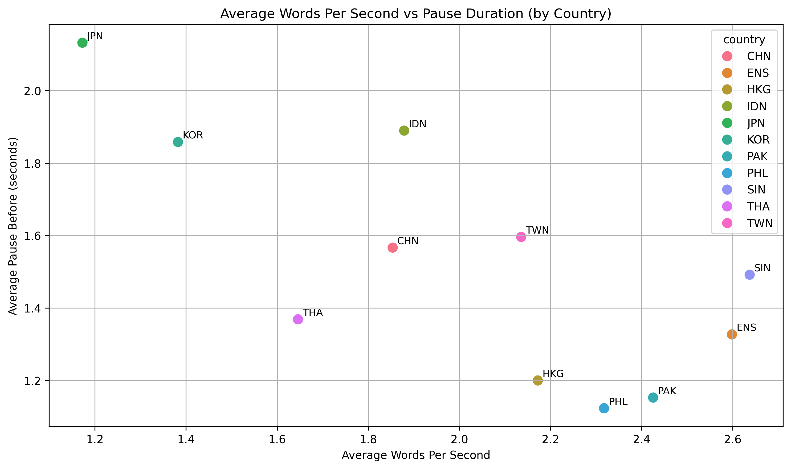

# Cross-Country Fluency Analysis Using Whisper & ICNALE Spoken Corpus

This project analyzes second-language English fluency across countries using the ICNALE Spoken Monologue dataset and OpenAI Whisper. I extract segment-level features such as speaking rate and pause duration, and compare fluency profiles across L2 backgrounds.



## Average Words Per Second vs. Pause Duration (by Country)
This scatterplot compares speaking rate (X-axis) and average pause length (Y-axis) across countries using data from the ICNALE Spoken Monologue corpus.

Insights:

🇯🇵 Japanese and 🇰🇷 Korean learners tend to speak slower and pause longer, suggesting greater planning time or hesitation during speech.

🇵🇭 Filipino, 🇵🇰 Pakistani, and 🇭🇰 Hong Kong speakers demonstrate fast and fluent speech with short pauses, comparable to or exceeding native English speakers (ENS).

🇸🇬 Singaporean speakers show the highest speaking rate, though with slightly longer pauses than ENS — possibly reflecting fast, chunked delivery patterns.

🇮🇩 Indonesian and 🇨🇳 Chinese learners display moderate fluency, with varying pause behavior.

🇹🇭 Thai and 🇹🇼 Taiwanese learners sit near the middle range of fluency and pausing.

This plot helps visualize cross-linguistic fluency differences, with ENS serving as a native benchmark for pause efficiency and tempo.
## Structure
```
data/
├── wav/                            # Audio files (converted to .wav)
├── whisper_outputs/                # Transcriptions from Whisper
└── segment_level_analysis.csv      # Main dataset used in analysis

scripts/
├── convert_to_wav.py
├── run_whisper.py
└── extract_segments_to_csv.py

notebooks/
└── analysis.ipynb
```

## Requirements
Install with:
```bash
pip install -r requirements.txt
```

## Run Steps
1. Convert audio:
   ```bash
   python scripts/convert_to_wav.py
   ```
2. Transcribe with Whisper:
   ```bash
   python scripts/run_whisper.py
   ```
3. Extract segments:
   ```bash
   python scripts/extract_segments_to_csv.py
   ```
4. Run Jupyter Notebook:
   ```bash
   jupyter notebook notebooks/analysis.ipynb
   ```

## Data Source
[ICNALE Spoken Monologue Corpus](https://language.sakura.ne.jp/icnale/)

This repository does not include any raw audio or CSV data derived from the ICNALE Spoken Monologue Corpus, as redistribution is not permitted. Only code and generated visualizations are shared. If you wish to use the same dataset, please obtain it from the official ICNALE site


## Author
Risang-L
